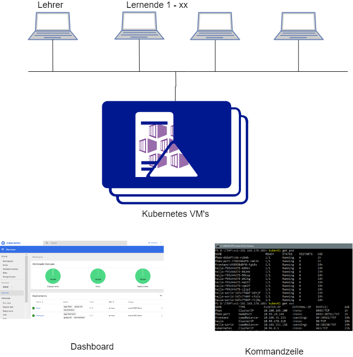

lernkube - Kubernetes Umgebung 
------------------------------

Die Scripts in diesem Verzeichnis dienen dazu um Kubernetes Umgebungen mit einer Instanz pro Lehrer/Lernende aufzubauen.

Mit einer Kubernetes Umgebung können die Lernenden nur mit einem Browser auf eine Vielzahl von Applikationen zugreifen. Die eigentlichen Applikationen laufen pro Lehrer/Lehrende auf einer eigenen Virtuellen Maschine (VM). Das hat den Vorteil, dass bei Problemen einfach die VM frisch erstellt werden kann.

Werden die Applikationen vom Lehrer gleich mit der VM aufbereitet, kann gänzlich auf Client Installationen verzichtet werden. Dazu kann das Vagrantfile im `template` Verzeichnis erweitert werden, z.B. 

Original:

	Vagrant.configure("2") do |config|
	...
	    # Dashboard und User einrichten
	    kubectl apply -f https://raw.githubusercontent.com/kubernetes/dashboard/master/src/deploy/recommended/kubernetes-dashboard.yaml
	    kubectl create -f /vagrant/addons/dashboard-admin.yaml
	SHELL

Beispiel OS Ticket

	Vagrant.configure("2") do |config|
	...
	    # Dashboard und User einrichten
	    kubectl apply -f https://raw.githubusercontent.com/kubernetes/dashboard/master/src/deploy/recommended/kubernetes-dashboard.yaml
	    kubectl create -f /vagrant/addons/dashboard-admin.yaml
	    
	    # OS Ticket
	    kubectl create -f https://raw.githubusercontent.com/mc-b/devops/master/kubernetes/osticket/mysql.yaml
		kubectl create -f https://raw.githubusercontent.com/mc-b/devops/master/kubernetes/osticket/osticket.yaml
	SHELL

Weitere Beispiele siehe das github Projekt [devops](https://github.com/mc-b/devops/tree/master/kubernetes).

### Voraussetzungen

Einen oder mehrere Standard PC mit ca. 32 GB RAM und 256 GB HD.

Eine freien IP-Bereich z.B. 10.1.66.10 - 10.1.66.40, wo fixe IP-Adressen vergeben werden können.

### Grundinstallation

Ubuntu 16.x Server installieren.

Weitere Software als `root` mit dem Script `installvv.sh` installieren.

	sudo bash -x installvv.sh

Im Detail sind das u.a.:
* [VirtualBox](https://www.virtualbox.org/) - die Virtualisierungs Umgebung
* [Vagrant](https://www.vagrantup.com/) - Automatisierungs Lösung für VM aus dem Bereich Infrastructure as Code.

### `template` Verzeichnis 

Das `template` Verzeichnis enthält ein `Vagrantfile` um die Kubernetes Instanzen aufzusetzen. 

Das Verzeichnis inkl. dem Stammverzeichnis `lernkube` ist auf den bereitgestellten Server zu kopieren oder einfach via git zu clonen:

	git clone https://github.com/mc-b/lernkube.git
	
Und die restliche Client Software aus dem Internet zu laden und bereitzustellen, dass sind:

* [Git Portable](https://git-scm.com/download/win) - entpacken in Verzeichnis `template/git`
* [Firefox Portable](https://portableapps.com/de/apps/internet/firefox_portable) - entpacken in Verzeichnis `template/firefox`
* [docker.exe](https://download.docker.com/win/static/stable/x86_64/) - entpacken in Verzeichnis `templates/bin`
* [kubectl.exe](https://storage.googleapis.com/kubernetes-release/release/v1.10.0/bin/windows/amd64/kubectl.exe) - abstellen in Verzeichnis `templates/bin`

Das Ergebnis sollte wie folgt aussehen:
* lernkube/templates/bin/docker.exe
* lernkube/templates/bin/kubectl.exe
* lernkube/templates/git/git-bash.exe und weitere Dateien
* lernkube/templates/firefox/FirefoxPortable.exe und weitere Dateien

### Kubernetes Instanzen

Die restlichen Arbeiten übernimmt das Script `create.sh`.

Es beinhaltet die Funktionen:
* vm - Erstellt die Kubernetes Instanzen und bereitet die Client SW als ZIP-Datei auf. Evtl. vorhandene Instanzen werden vorher gelöscht.
* client - nur Client SW aufbereiten
* destroy - Aufräumen, die erstellten Instanzen werden gelöscht.

Vor dem Aufruf von `sudo bash create.sh vm` müssen die Anzahl Instanzen und die Anfangs-IP ggf. geändert werden.

`create.sh` editieren und folgende Zeilen anpassen:

	export TEACHERS="xx1 xx2"
	export FIP=60
	
* TEACHERS = Anfangskürzel der Instanzen, xx1 ergibt Hostname `xx1kube`.
* FIP = erste IP-Adresse, ab dieser werden die IP-Adressen fix vergeben.

Z.B. ändern in:

	export TEACHERS="ben bem cal ror"
	export FIP=10	 
	
Es werden die Instanzen mit dem Hostnamen `benkube`, `bemkube`, `calkube` und `rorkube` angelegt. Die IP Adressen werden ab 10 vergeben.

Soll ein anderer IP-Adressbereich als `10.1.66.xxx` verwendet werden, ist in den Dateien `create.sh` und `Vagrantfile` zu ändern.
Das geht am einfachsten durch Suchen und Ersetzen aller Vorkommnisse. In `Vagrantfile` ist auch der Default-Gateway `10.1.66.254` zu ändern.

Anschliessend können die Instanzen wie folgt erstellt werden:

	sudo bash create.sh vm
	
Es werden die, oben beschriebenen, Instanzen erstellt und pro Instanz die Client SW als ZIP-Datei aufbereitet.

Die ZIP-Dateien sind auf die Client zu kopieren und im HOME-Verzeichnis des User zu entpacken.

Dabei werden folgende Verzeichnisse und Dateien erstellt:
* .kube - Zugriff Zertifikate für Kubernetes Instanz
* .docker - Zugriff Zertifikate für Docker Daemon auf Kubernetes Instanz
* .ssh - Private Key für den Zugriff auf VM mittels `ssh xxxkube`
* bin - Kommandlineprogramme wie `kubectl` und `docker` zum Starten und Builden von Images
* firefox - Firefox Portable um Probleme mit vorinstalliertem MS Internet Explorer zu vermeiden
* git - Git/Bash Umgebung um Projekte von [http://github.com](http://github.com) zu clonen
* dashboard.bat - Aufruf des Dashboards um Pod/Container zu starten
* dockerps.bat - Setzen der Umgebungsvariablen für den Zugriff auf die Kubernetes Instanz und starten Powershell
* dockersh.bat - dito für Bash Umgebung
* bin/startsvc.bat - Ermitteln des Ports eines Services und Start Browser.

Werden die ZIP-Dateien woanders als im HOME-Verzeichnis entpackt, ist im HOME-Verzeichnis ein .kube/config Datei mit leerem Inhalt anzulegen. Ansonsten kommt `kubectl` auf einen Fehler.

### Testen

Zum Testen eignet sich die Applikation [FHEM](http://fhem.de), eine kleine Hausautomationssteuerung.

Sie lässt sich via URL oder Port Variante ansprechen.

Die Port Variante wird wie folgt gestartet:

	kubectl create -f https://raw.githubusercontent.com/mc-b/devops/master/kubernetes/iot/fhem-port.yaml
	startsvc fhem-port
	
Und die URL Variante wie folgt:

	kubectl create -f https://raw.githubusercontent.com/mc-b/devops/master/kubernetes/iot/fhem.yaml
	
um anschliessend das UI über den URL `https://<ip Instanz>:30443/fhem` anzusprechen.

Es werden zwei Instanzen von [FHEM](http://fhem.de) gestartet. Jede Instanz ist normalerweise über einen von Kubernetes automatisch vergebenen Port ansprechbar. Wird zusätzlich in Ingress Eintrag erstellt, kann ein Service über einen fixen URL erreicht werden.

Der [YAML Eintrag](https://de.wikipedia.org/wiki/YAML) sieht dabei wie folgt aus:

	apiVersion: extensions/v1beta1
	kind: Ingress
	metadata:
	  name: fhem
	spec:
	  rules:
	  - http:
	      paths:
	      - path: /fhem
	        backend:
	          serviceName: fhem
	          servicePort: 8083
 
Für weitere Beispiele siehe das github Projekt [devops](https://github.com/mc-b/devops/tree/master/kubernetes).

 